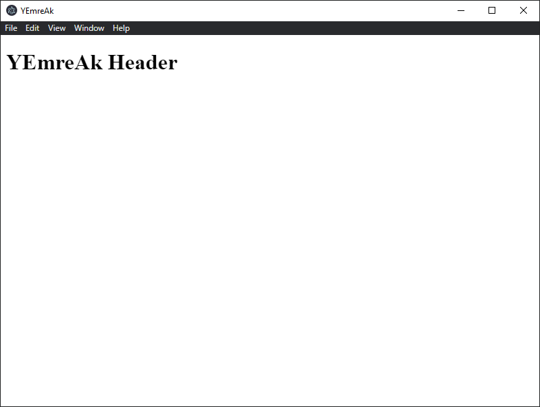
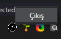

# Electron Uygulaması

Öğrenme amaçlı ufak elektron çalışmalarım

- ✴️ <kbd>✲ Ctrl</kbd> + <kbd>L</kbd> ile pencere açar
- 🌟 Tray ikon üzerinden kapatılır

## ⭐ Resimler

## 🔗 Faydalı Kaynaklar

- [👪 Global Shortcut oluşturma ve başlangıçta başlatma](https://stackoverflow.com/a/59407418)
- [📖 Global Shortcut](https://www.electronjs.org/docs/api/global-shortcut)
- [📖 Tray Icon](https://www.electronjs.org/docs/api/tray)
- [💻 Electron exit to tray](https://gist.github.com/hyrious/b76b3a1042907421feb68261f505f0eb)